# Maximum Throughput Sorry-Filling Plan

## Current State

| File | Sorries | Already running agent? |
|------|---------|----------------------|
| `Core/Digits.lean` | 16 | Yes (22dbf2d1, 86 turns in, likely wrapping up) |
| `Core/Generic_fmt.lean` | 3 | Yes (53ce2a4e, still on turn 1, actively editing) |
| `Core/Ulp.lean` | 9 | Yes (e715957c, still on turn 1) |
| `Prop/Relative.lean` | 42 | Yes (8c529c8f, 18 turns, filled 4 conversion lemmas) |
| `IEEE754/Decoder.lean` | 1 | No |

## Dependency Graph

```mermaid
graph TD
  subgraph layer0 [Layer 0: Fully Independent]
    D_nonzero["Digits: Zdigits_implies_nonzero_digit"]
    D_slice["Digits: Zdigits_slice"]
    D_div["Digits: Zdigits_div_Zpower"]
    D_succ["Digits: Zdigits_succ_le"]
    D_spb["Digits: Zdigits_sum_product_bound"]
    D_lt["Digits: lt_Zdigits"]
    D_lzp["Digits: Zdigits_le_Zpower"]
    D_le["Digits: Zdigits_le"]
    D_mzp["Digits: Zdigits_mult_Zpower"]
    G_rdn["Generic_fmt: round_DN_exists"]
    G_csm["Generic_fmt: consecutive_scaled_mantissas_ax"]
    G_mono["Generic_fmt: round_to_generic_monotone"]
    U_half["Ulp: error_le_half_ulp_theorem"]
    U_rnulp["Ulp: ulp_roundN_eq_ulp_x_bridge"]
    U_ps["Ulp: pred_succ_theorem"]
    U_sll["Ulp: succ_le_lt_theorem"]
    U_bnd["Ulp: ulp_at_pos_boundary_theorem"]
    U_gfp["Ulp: generic_format_pred_aux1_theorem_early"]
    U_rdn["Ulp: round_DN_plus_eps_theorem"]
    U_rnug["Ulp: round_N_plus_ulp_ge_theorem"]
    DEC["Decoder: toReal_neg"]
  end

  subgraph layer1 [Layer 1: Depends on Layer 0]
    D_zp["Digits: Zdigits_Zpower"]
    D_plz["Digits: Zpower_le_Zdigits"]
    D_lld["Digits: Zdigits_le_Zdigits"]
    D_ms["Digits: Zdigits_mult_strong"]
    D_m["Digits: Zdigits_mult"]
    D_mg["Digits: Zdigits_mult_ge"]
    G_mrzr["Generic_fmt: mag_round_ZR subgoal"]
  end

  subgraph layer2 [Layer 2: Depends on Layer 1]
    U_urp["Ulp: ulp_round_pos_theorem"]
  end

  subgraph layerR [Relative.lean: 42 sorries, all independent of Core]
    R_gen["relative_error, _ex, _F2R_emin, etc. (6)"]
    R_near["relative_error_N, _ex, _F2R_emin, etc. (6)"]
    R_flx["relative_error_FLX*, u_ro_*, _round, _ex (14)"]
    R_flt["relative_error_FLT*, _N_FLT*, error_N_FLT (16)"]
  end

  D_mzp --> D_zp
  D_lt --> D_lld
  D_le --> D_plz
  D_spb --> D_ms
  D_ms --> D_m
  D_m --> D_mg
  G_rdn --> G_mrzr
  G_mrzr --> U_urp
```

## Dispatch Strategy

The key insight: **Relative.lean's 42 sorries are completely independent of the Core sorries.** They are pure Flocq-style proofs about rounding and error bounds that only depend on *already-proved* Core infrastructure. So we can attack them in full parallel with Core work.

### Wave 1: Right Now (you spawn these)

These are the agents you should launch from separate Cursor chat windows. Each gets one focused job.

**Agent R1 -- Relative.lean generic error block (6 sorries, lines 78-118)**
- `relative_error`, `relative_error_ex`, `relative_error_F2R_emin`, `relative_error_F2R_emin_ex`, `relative_error_round`, `relative_error_round_F2R_emin`
- Strategy: prove `relative_error` first (the key one), then derive the `_ex` variants using the conversion lemmas already proved, and the `_round` variants by switching the error from `|r-x|` to `|r-x|` in terms of `|r|`.

**Agent R2 -- Relative.lean nearest-rounding block (6 sorries, lines 129-167)**
- `relative_error_N`, `relative_error_N_ex`, `relative_error_N_F2R_emin`, etc.
- Strategy: same pattern as R1 but specialized to `Rnd_N` (round-to-nearest). Each is a corollary of `relative_error` restricted to nearest rounding.

**Agent R3 -- Relative.lean FLX block (14 sorries, lines 176-257)**
- `relative_error_FLX_aux` through `relative_error_N_FLX_round`
- Plus `u_ro_pos`, `u_ro_lt_1`, `u_rod1pu_ro_pos`, `u_rod1pu_ro_le_u_ro`
- Strategy: FLX is the "no minimum exponent" format. The `u_ro` lemmas are simple `norm_num` about `β^(1-p)/2`. The FLX error theorems are specializations of the generic ones.

**Agent R4 -- Relative.lean FLT block (16 sorries, lines 266-397)**
- `relative_error_FLT_aux` through `error_N_FLT`
- Strategy: FLT = "with minimum exponent". These are the **most important** for Falcon (binary64 = FLT with emin=-1074, p=53). Prove `relative_error_FLT_aux` first, then derive all corollaries.

**Agent U1 -- Ulp.lean independent sorries (7 sorries)**
- `error_le_half_ulp_theorem`, `ulp_roundN_eq_ulp_x_bridge`, `pred_succ_theorem`, `succ_le_lt_theorem`, `ulp_at_pos_boundary_theorem`, `generic_format_pred_aux1_theorem_early`, `round_DN_plus_eps_theorem`
- These are all independent of each other and of the Core sorries above them.

**Agent U2 -- Ulp.lean dependent sorries (2 sorries)**
- `round_N_plus_ulp_ge_theorem`, `ulp_round_pos_theorem`
- Wait for `mag_round_ZR` in Generic_fmt to land first. Can start on `round_N_plus_ulp_ge_theorem` immediately (it's independent).

### Wave 2: After Current Agents Finish

Once the existing 4 agents complete, assess what's left:

**Agent D-chains -- Digits.lean chains**
- The remaining Digits sorries form small chains (see dependency graph above). Group them: `Zdigits_mult_Zpower` then `Zdigits_Zpower`; `lt_Zdigits` then `Zdigits_le_Zdigits`; `Zdigits_sum_product_bound` then `Zdigits_mult_strong` then `Zdigits_mult` then `Zdigits_mult_ge`.

**Agent G-last -- Generic_fmt.lean remaining**
- `mag_round_ZR` subgoal (critical path for Ulp.lean)
- If `round_DN_exists` or `consecutive_scaled_mantissas_ax` are still open

**Agent DEC -- Decoder.lean `toReal_neg`**
- Standalone bitvector proof about XOR with sign bit. Independent of everything else.

## Agent Template

Each agent you spawn should get this preamble:

> You are working in `/Users/quang.dao/Documents/Lean/FloatSpec`. Lean 4 v4.29.0, Mathlib v4.29.0. autoImplicit is ON. Do NOT use `set_option linter.* false`. Use `grind` instead of `omega`. Use `simp` instead of `simp only`. Use the Lean LSP tools (`lean_goal`, `lean_multi_attempt`, `lean_hover_info`) to check proof states before editing. For each sorry: (1) read 20 lines of context, (2) check the Coq proof in the docstring/comments if present, (3) use `lean_goal` to see the proof state, (4) try tactics with `lean_multi_attempt`, (5) edit the file only when you have a working proof.

## Expected Throughput

- **8 parallel agents** (4 on Relative.lean by section, 2 on Ulp.lean by dependency, 1 on remaining Digits chains, 1 on Generic_fmt last pieces)
- Plus the **4 agents already running** (which may finish and deliver results during Wave 1)
- Target: **all 71 sorries attempted within 2 waves**, with the critical-path items (`relative_error_FLT*`, `error_le_half_ulp_theorem`, `mag_round_ZR`) prioritized
